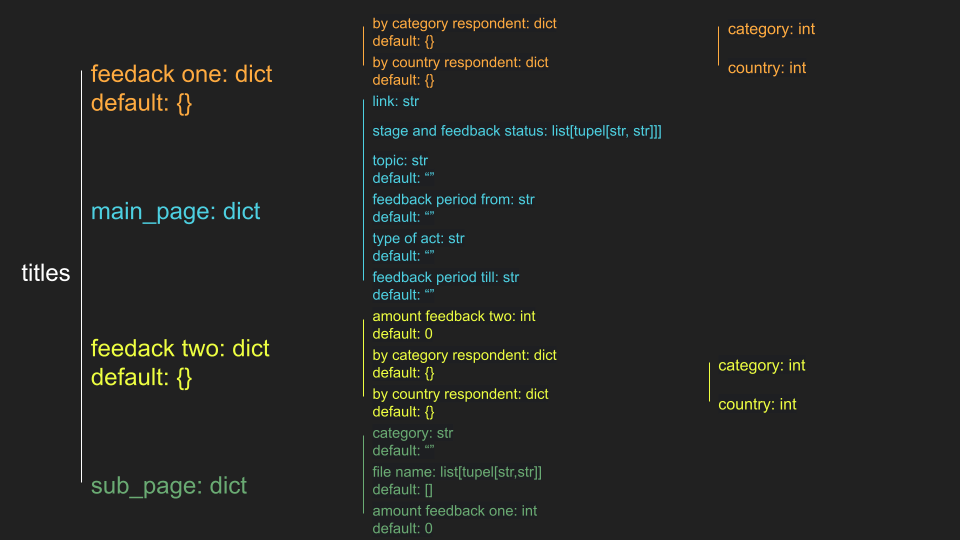

# scrape_your_say

This is a webscraper that is collecting information about the published initiatives from the project "Have your Say"

## table of contents

- [Installation](#installation)
- [Usage](#usage)
- [Prescraped data](#pre-scraped-data)
- [License](#license)


## installation

1. Clone repository:
```bash
git clone https://github.com/Mia-Deutsch/scrape_your_say.git
```
2. Install dependencies:
```bash
pip install selenium
```

## usage

To run the webscraper just execute main.py:
```bash
py main.py
```
It took me for ~3370 initiatives 13 hours and 40min to scrape all the data. If you want to reduce the time it takes to scrape all the data, you can cut down the waiting time by changing the max waiting time for an Element to load:
1. Open [driver_config.yml](driver_config.yml)
2. Change the timeout argument
```yaml
chrome_settings:
  - "--window-size=1920,1080"
  - "start-maximized"
  - "headless"
webdriver_wait:
  timeout: 3 #<-----
```

## pre scraped data

The pre scraped data is in the [scraped_data.yaml](scraped_data.yaml) and can be downloaded. It contains 3383 initiatives ~4MB of data and almost anything that could be relevant.

### structure


## license

This project is licensed under the [GNU general public license](LICENSE.md)
